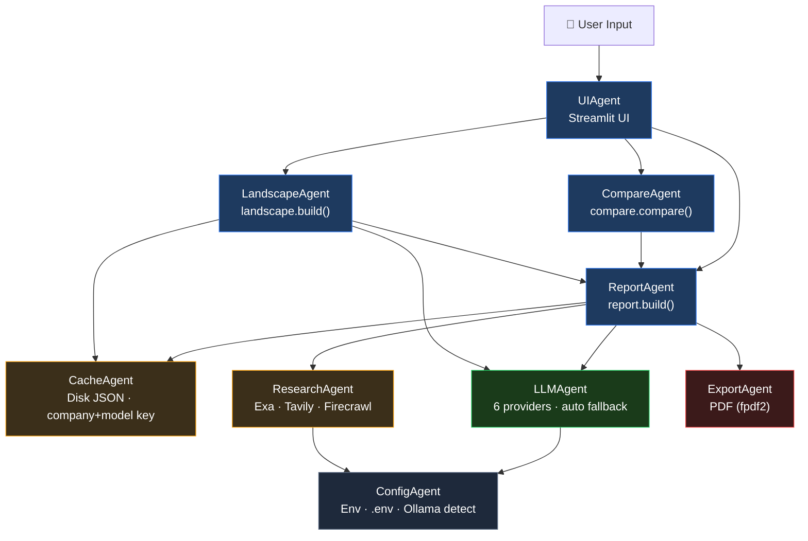

<div align="center">

# 🔎 AI-Powered Research & Recommendation Agent

**Turn any company name into a structured intelligence report with AI-opportunity pitch.**

[](https://python.org)
[](https://streamlit.io)
[](https://docker.com)
[](https://docs.pytest.org)
[](https://groq.com)
[](https://deepmind.google/gemini)
[](LICENSE)

<br/>


</div>

<br/>

---

## 📋 Overview

This system ingests a **company name** and automatically produces a **professional-grade intelligence report** — covering company overview, key business context, potential challenges, AI transformation opportunities, and a personalized CEO pitch. It supports multiple LLM and search providers with automatic failover, disk-backed caching, and PDF export.

**Demo:** Enter "Sobha", "Adani Realty", or any company — the system researches, analyzes, and delivers a structured report in seconds.

---

## ✨ Capabilities

| Feature | What it does |
|---------|-------------|
| **Single Report** | Generates company overview, business context, 3-4 challenges across 3 categories, 4-5 AI opportunities across 6 functions, and a CEO-ready pitch. |
| **Compare Mode** | Side-by-side comparison of 2+ companies across scale, geographic reach, top challenge, AI readiness, and recommended first AI win. |
| **Competitive Landscape** | Analyzes 3-5 competitors: market overview, positioning map, strengths/weaknesses, strategic gaps, and per-company recommendations. |
| **6 LLM Providers** | Groq (free), Gemini (free), OpenRouter (free), Ollama (local), Claude (paid), GPT-4o (paid) — with automatic fallback chain. |
| **3 Search Providers** | Exa, Tavily, Firecrawl for live web research. Falls back to LLM-knowledge mode when no search key is configured. |
| **Export** | Download reports as PDF (via fpdf2) — single reports, landscape overviews, and per-company PDFs. |
| **Disk Cache** | Reports are cached by company + provider key. Zero-cost repeat lookups. Force-refresh to regenerate. |
| **Custom URLs** | Paste reference links in any tab — stored as additional sources for the LLM to reference. |
| **Inline API Key Setup** | Configure any provider directly from the sidebar — no file editing required. |

---

## 🏗️ Architecture — 9-Agent System

Each agent has a **defined system prompt, explicit context boundaries, and a strict "do not do" list** embedded in its module docstring — preventing role leakage and keeping the system testable and maintainable.



### Agent Breakdown

| Agent | Module | Responsibility |
|-------|--------|---------------|
| **ConfigAgent** | `config.py` | Reads environment variables and `.env`; detects available LLM/search providers; maintains priority ordering. Pure functions, zero SDK imports at module level. |
| **CacheAgent** | `cache.py` | Persistent JSON cache keyed by `{company}__{provider}`. Handles read/write with atomic file operations. |
| **ResearchAgent** | `research.py` | Fires targeted web queries — company overview, recent news, financials — on the first available search provider. Normalizes results into `Source` records clipped to 1200 chars each (max 8). |
| **LLMAgent** | `llm.py` | Routes `(system, prompt)` pairs to 6 providers. Tries the requested provider first, then falls through the remaining chain in priority order. All SDK imports are lazy — no import cost for unused providers. |
| **ReportAgent** | `report.py` | Orchestrates the core pipeline: validate → check cache → research → build prompt → LLM call → defensive JSON parse → coerce to `Report` dataclass → write cache. Owns the SYSTEM prompt that defines the advisor persona. |
| **CompareAgent** | `compare.py` | Builds individual reports (with cache reuse), then makes one extra LLM call for a relative comparison matrix across 5 dimensions. |
| **LandscapeAgent** | `landscape.py` | Aggregates individual reports + research sources, then calls the LLM with a strategy-consultant prompt for competitive analysis. |
| **ExportAgent** | `export.py` | Formats `Report` and `CompetitiveLandscape` dataclasses into Markdown and PDF (fpdf2 — pure Python, zero system dependencies). |
| **UIAgent** | `app.py` | Streamlit web UI with 3 tabs, sidebar API key configuration, model selector, system status dashboard, and download buttons. Strictly presentation — no business logic. |

---

## 🚀 Getting Started

### Prerequisites

- **Python 3.10+** (3.13 tested)
- **One API key** (recommended: [Groq](https://console.groq.com) — free, instant setup)
- **OR** [Ollama](https://ollama.ai) for fully local inference

### Option 1: One-command setup ⭐

```bash
python setup.py
```

Creates a virtual environment, installs dependencies, copies `.env.example`, and starts the app at `http://localhost:8501`.

### Option 2: Docker

```bash
docker compose up
```

Opens at [http://localhost:8501](http://localhost:8501) with no Python setup needed.

### Option 3: Manual

```bash
pip install -r requirements.txt
cp .env.example .env
# Edit .env — add at least GROQ_API_KEY
streamlit run app.py
```

### Option 4: CLI (no UI)

```bash
python -m agent.report "Sobha" --force
python -m agent.compare "Sobha" "Prestige Group"
python -m agent.landscape "Sobha" "Prestige" "Brigade"
```

---

## 🔑 API Key Reference

| Provider | Type | Free? | Env Variable |
|----------|------|-------|-------------|
| **Groq** | LLM | ✅ | `GROQ_API_KEY` — [console.groq.com](https://console.groq.com) |
| **Gemini** | LLM | ✅ Free tier | `GEMINI_API_KEY` — [aistudio.google.com](https://aistudio.google.com) |
| **OpenRouter** | LLM | ✅ Free models | `OPENROUTER_API_KEY` — [openrouter.ai](https://openrouter.ai) |
| **Ollama** | LLM | ✅ No key | Local — `ollama pull llama3.2` |
| **Claude (Anthropic)** | LLM | 💲 Paid | `ANTHROPIC_API_KEY` |
| **GPT-4o (OpenAI)** | LLM | 💲 Paid | `OPENAI_API_KEY` |
| **Exa** | Search | ✅ | `EXA_API_KEY` |
| **Tavily** | Search | ✅ | `TAVILY_API_KEY` |
| **Firecrawl** | Search | ✅ | `FIRECRAWL_API_KEY` |

> **One key is enough.** The app auto-detects what's configured. No search key = LLM-knowledge mode. Keys can also be entered directly in the sidebar UI.

---

## 🧪 Testing

```bash
python -m pytest -q
```

**23 tests** covering:
- Provider detection and priority ordering
- Defensive JSON extraction (fenced code blocks, wrapped prose, standard JSON)
- Category and function name normalization
- Cache round-trip (save → load → verify)
- Markdown and PDF output structure and completeness
- End-to-end report build with simulated LLM (including bad-JSON repair path)
- Landscape build orchestration

---

## 🧠 Engineering Highlights

| Challenge | Solution |
|-----------|----------|
| Free models return **inconsistent JSON** | Multi-layered parser: strip fences → extract `{...}` → try `json.loads` → if all fail, retry with "valid JSON only" prompt |
| Must run **with or without** API keys | All providers auto-detected; graceful degradation to LLM-knowledge mode; sidebar key entry for instant activation |
| **Provider downtime** breaks demos | Full fallback chain across all 6 LLM providers — if Groq fails, try Gemini, then OpenRouter, and so on |
| **Small context windows** on free models | Source text clipped to 1200 chars per result, max 8 results — fits comfortably in 8K-16K context windows |
| **PDF generation** without system libraries | fpdf2 — pure Python, no LaTeX, no wkhtmltopdf, no system dependencies |
| **Generic AI advice** (the "any company" problem) | Every prompt forces per-company reasoning grounded in real offerings, with schema requiring specific evidence |
| **Role leakage** between components | Each agent module has a documented SYSTEM prompt, CONTEXT, and strict BOUNDARIES list — enforced by code review, not at runtime |

---

## 📁 Project Structure

```
├── app.py                    # UIAgent — Streamlit UI (3 tabs, sidebar, renders)
├── setup.py                  # SetupAgent — one-command venv + install + launch
├── Dockerfile                # Container build
├── docker-compose.yml        # Container orchestration
├── requirements.txt          # Python dependencies
├── .env.example              # Configuration template (gitignored)
│
├── agent/
│   ├── __init__.py           # Agent registry, __version__ = "1.1.0"
│   ├── config.py             # ConfigAgent — env detection, provider status
│   ├── cache.py              # CacheAgent — disk-backed JSON cache
│   ├── research.py           # ResearchAgent — web search (Exa/Tavily/Firecrawl)
│   ├── llm.py                # LLMAgent — 6 providers, fallback chain
│   ├── report.py             # ReportAgent — core pipeline + prompts
│   ├── compare.py            # CompareAgent — multi-company comparison
│   ├── landscape.py          # LandscapeAgent — competitive analysis
│   └── export.py             # ExportAgent — PDF + Markdown export
│
├── tests/                    # 23 pytest unit tests
├── cache/                    # Generated report cache (gitignored)
└── .demo_cache/              # Pre-seeded demo reports
```

---

## 🛠️ Technology Stack

| Layer | Technology |
|-------|-----------|
| **Frontend** | [Streamlit](https://streamlit.io) 1.56+ |
| **LLM Interface** | Groq SDK · Google Generative AI · OpenAI SDK · Anthropic SDK · Ollama SDK |
| **Web Search** | Exa · Tavily · Firecrawl |
| **PDF Export** | [fpdf2](https://pyfpdf.github.io/fpdf2/) (pure Python) |
| **Container** | Docker · Docker Compose |
| **Language** | Python 3.10+ (3.13 tested) |
| **Testing** | pytest |

---

<div align="center">

**AI/ML Intern Assessment** · 9 specialized agents · 6 LLM providers · 3 search providers · 23 unit tests

[Report Bug](../../issues) · [Request Feature](../../issues)

</div>
